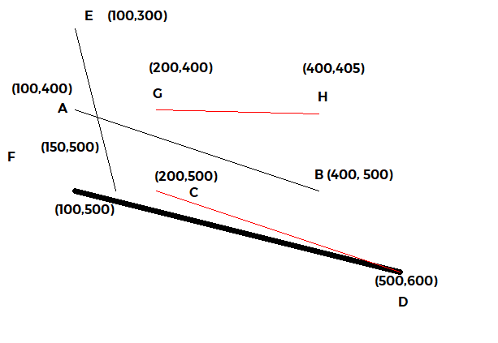

# Lab 1
Draw line by 2 algorithm: Bresenham and DDA
The intuition of the two have been commented in the [CLine class](./lab1/CLine.cpp), to see the overview function of the class CLine, travel to [CLine header](./lab1/CLine.h)

The onDraw function is in the [View](./lab1/Lab1View.cpp) where I have called and init several points, using the default included pDC->LineTo function to draw the black thick line, thin thick line are lines draw by applying Bresenham algorithm, while the red straight illustrators are from implementing DDA algorithm.