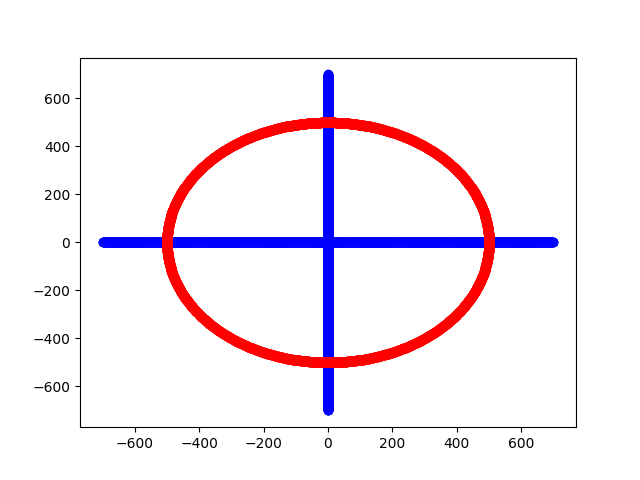

# Lab 2 - Draw a circle by using mid point

Update 25/09/2021: Finished work. 

The main work is in [class Circle](./Circle.py). Go check it out. X and Y axis is draw using CLine and CPoint in Lab1 [link](../Lab1-Python/main.py)